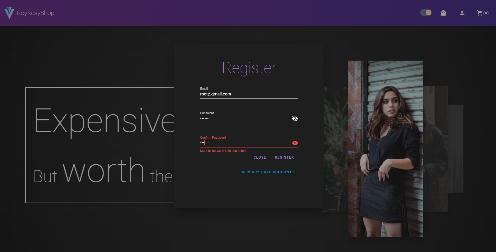
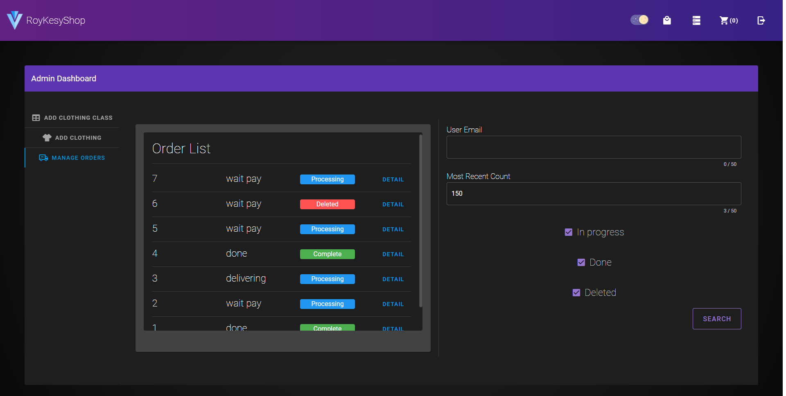

# RoyKesyShop
A project composed of nginx + vue + flask + mariadb, the project is for practice use.

## How To Create Your Own Bot

1. write config.yml

1. write .env
    
1. If you're not using docker with wsl2, you might need to change 
    ```
    upstream backend{
        server host.docker.internal:5000;
    }
    ```
    in nginx_conf/conf.d/default.conf

2. ```bat
    docker-compose up -d
    ```
## How to Shut down
```
docker-compose down
```

## Demo Pictures
### Home Page


### Login/Register



### Shop Page


### Clothing Detail


### Cart

### Personal Order


### Admin Dashboard





### TODO
- mariadb replication


## Demo picture source
- unsplash.com