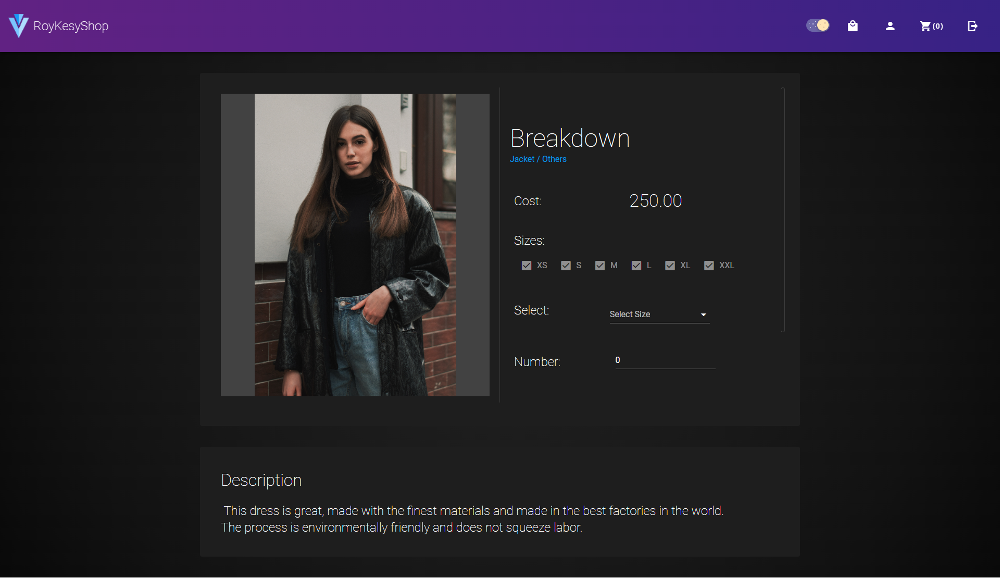

# RoyKesyShop
A project composed of nginx + vue + flask + mariadb, the project is for practice use.

## How To Execute

1. write ./backend/config.yml

1. write .env
    
1. If you're not using docker with wsl2, you might need to change 
    ```
    upstream backend{
        server host.docker.internal:5000;
    }
    ```
    in nginx_conf/conf.d/default.conf

2. ```bat
    docker-compose up -d
    ```

3. When starting for the first time or want to clear the database, please execute the following command
```
cd ./backend
pipenv install
pipenv run python init_database.py
```
## How to Shut down
```
docker-compose down
```

## Frontend Demo Pictures
### Home Page


### Login/Register


### Shop Page


### Clothing Detail



### Cart

### Personal Order


### Admin Dashboard


## Backend

get more information in http://localhost:5000/apidocs/

## Port
port | service
-- | --
3310 | Adminer
5000 | backend
80 | nginx

### TODO
- Set appropriate http status code


## Demo picture source
- unsplash.com